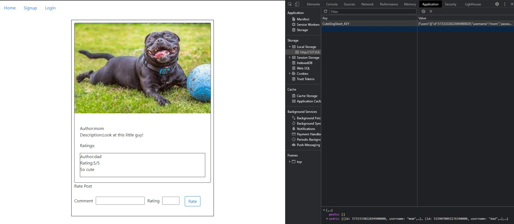

# CS410: Rust Programming Course Project
##### by Carlos Sotello

## CuteDogStash
CuteDogStash is an open source single-page application for storing photos of dogs. 
Using [Yew](https://github.com/yewstack/yew) and [Trunk](https://github.com/thedodd/trunk), rust code will be bundled into HTML, JavaScript, and WebAssembly to run in browsers. Ideally this is a good first step toward providing a family centered site which can be used on a shared computer.  

Users will be able to post pictures and descriptions which will persist through local storage. The sites main page displays all of the stored posts with links to create an account and sign in. Once users have an account additional links will display allowing them to create posts, view posts by account, and update their account info. When logged in posts by the user's account will also display edit and delete buttons which will update or remove the post from the database and update local storage.  

## Setup

The site can be accessed through GitHub Pages [here](https://csotello.github.io/CuteDogStash/) or the following instructions can be used to run it locally.

First, ensure [Rust](https://www.rust-lang.org/tools/install) is installed. 
After you can install trunk and wasm-bindgen using 
```
cargo install trunk wasm-bindgen-cli
```

The following command will build the site and output a link.
```
trunk serve
```
The home page will start out as a blank page with links. Some initial values have been provided in [init_vals.txt](init_vals.txt). Using chrome you can open developer tools(Ctrl-Shift-i) and navigate to the Application tab. Under storage and local storage should be the link to the local server. From there you can copy and paste the text in init_vals.txt to the value section for the CuteDogStash_KEY then reload the page. The screenshot below shows the section in developer tools and the initial post. There are three accounts with the same username and password: mom, dad, and son. 
 
## Testing 
Within the tests directory is a test file for the database. There are two main tests for basic CRUD functionality related to users and posts. These tests ensure that the data is stored and updated as expected by the main code. 

## How It Works
The Yew framework exposes two main traits to use throughout the project to implement renderable code: Component and Properties. Similar to [React.js](https://reactjs.org/), Yew components are structs that can be used as html tags throughout the project which will be translated properly at runtime. Similar to attributes like class and id these components can also be passed data which are refered to as Properties(or props). For example, the page to create a post is referenced like this:
```html
<Post db=&self.db callback=create_post user=&self.user/>
```
Here Post is the component with properties: db, callback, and user. 
In this case there is a reference to the database, a callback function to create the post, and information on the current user.
The component trait defines four functions that must be implemented:
```rust
fn create(props: Self::Properties, link: ComponentLink<Self>) -> Self {}
fn update(&mut self, msg: Self::Message) -> ShouldRender {}
fn change(&mut self, props: Self::Properties) -> ShouldRender {}
fn view(&self) -> Html {}
```
When a component first loads the create function is called and the initial values can be setup. Afterward, update handles messages which are used as signals for things like click events and change is used to update the component when its props change. The actual html corresponding to each component is defined in the view function. Using a Yew macro, rust and html can be used together to create reusable code compatible with data structures like vectors.   
    

## [LICENSE](LICENSE)
MIT License

Copyright (c) 2021 Carlos Sotello

Permission is hereby granted, free of charge, to any person obtaining a copy
of this software and associated documentation files (the "Software"), to deal
in the Software without restriction, including without limitation the rights
to use, copy, modify, merge, publish, distribute, sublicense, and/or sell
copies of the Software, and to permit persons to whom the Software is
furnished to do so, subject to the following conditions:

The above copyright notice and this permission notice shall be included in all
copies or substantial portions of the Software.

THE SOFTWARE IS PROVIDED "AS IS", WITHOUT WARRANTY OF ANY KIND, EXPRESS OR
IMPLIED, INCLUDING BUT NOT LIMITED TO THE WARRANTIES OF MERCHANTABILITY,
FITNESS FOR A PARTICULAR PURPOSE AND NONINFRINGEMENT. IN NO EVENT SHALL THE
AUTHORS OR COPYRIGHT HOLDERS BE LIABLE FOR ANY CLAIM, DAMAGES OR OTHER
LIABILITY, WHETHER IN AN ACTION OF CONTRACT, TORT OR OTHERWISE, ARISING FROM,
OUT OF OR IN CONNECTION WITH THE SOFTWARE OR THE USE OR OTHER DEALINGS IN THE
SOFTWARE.
